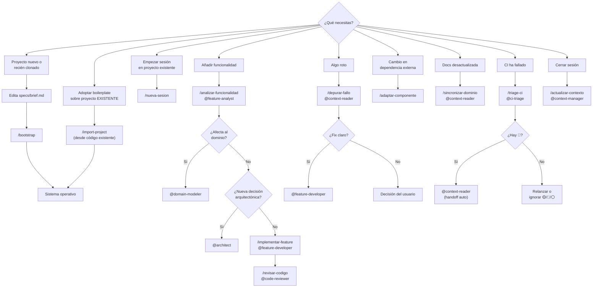

# Onboarding

Si acabas de clonar el repo y has leído el [`README.md`](../../README.md), esta guía te da el **modelo mental** necesario para usar el sistema con eficacia. Tiempo de lectura: ≤10 min.

Al final hay un árbol de decisión rápido para consultar después.

---

## 1. Los tres ingredientes

El sistema mezcla tres cosas. Entenderlas por separado ahorra confusión más adelante.

### 1.1 Agentes

Un [agente](GLOSARIO_SISTEMA.md#agente) es un **rol con identidad**: un conjunto de instrucciones + modelo asignado + permisos de escritura acotados. Cuando invocas `@spec-analyst`, no estás hablando con "Claude genérico", sino con una persona ficticia que solo sabe cerrar specs y no puede escribir código.

Los 9 agentes caen en 3 familias:

- **Bootstrap (3):** `spec-analyst`, `domain-modeler`, `architect`. Se usan solo al arrancar un proyecto.
- **Desarrollo (3):** `feature-analyst`, `feature-developer`, `code-reviewer`. El ciclo normal día a día.
- **Apoyo (3):** `context-reader` (lee repos vecinos, diagnostica), `context-manager` (guarda memoria), `ci-triage` (clasifica fallos de CI).

Cada uno tiene su propio ámbito de escritura — ver [`MATRIZ_PERMISOS.md`](MATRIZ_PERMISOS.md). Un `@feature-developer` **no puede** escribir en `DOMINIO.md`, por definición del sistema.

### 1.2 Prompts (slash-commands)

Un [prompt](GLOSARIO_SISTEMA.md#prompt) es una **receta** que se invoca con `/nombre`. Ejemplo: `/bootstrap`, `/analizar-funcionalidad`, `/actualizar-contexto`.

Un prompt no es un agente: **coordina una cadena de agentes** y define el orden + checkpoints. `/bootstrap` invoca a `spec-analyst`, luego `domain-modeler`, luego `architect`, luego `context-manager`, con confirmación del usuario entre fases.

Hay 11 prompts (ver `ai-specs/prompts/` o el `CLAUDE.md` raíz, que los lista todos).

### 1.3 Skills

Un [skill](GLOSARIO_SISTEMA.md#skill) es **conocimiento procedimental** que un agente activa por su cuenta cuando detecta que aplica. A diferencia de un prompt (invocas tú), un skill lo dispara el agente.

Hay 3 skills en este boilerplate:

- `memory-bank` — cómo leer/escribir la memoria (CONTEXTO, DECISIONES) correctamente.
- `bootstrap-from-spec` — la cascada completa del bootstrap SDD.
- `quick-bootstrap` — variante rápida del anterior cuando el brief ya es rico.

---

## 2. El modelo mental de la memoria

Esta es la parte que más confusión crea al empezar. La memoria del sistema tiene **cuatro capas** por volatilidad, y cada una tiene reglas distintas.

```
  VOLÁTIL ←─────────────────────────── ESTABLE ─────────────────────────── HISTÓRICA
     │                                    │                                    │
     ▼                                    ▼                                    ▼
docs/sesion/                      docs/referencia/                      docs/archivo/
├── CONTEXTO.md  (≤80 líneas)     ├── DOMINIO.md                        └── DECISIONES_HISTORICO.md
├── DECISIONES.md (8 categorías)  ├── GLOSARIO.md                          (append-only)
└── TRIAGE_CI.md                  ├── ARQUITECTURA.md
                                  ├── CATALOGO.md                       specs/historico/
                                  └── COBERTURA.md                      (specs cerradas archivadas)
```

**Volátil (cambia cada sesión):** `CONTEXTO.md` se sobrescribe completo; `DECISIONES.md` se edita in-place por categoría. Ambos con backup automático (`.bak.md`) antes de cada modificación. Solo `context-manager` los toca.

**Estable (cambia ante decisiones formales):** `DOMINIO.md` cuando aparece una entidad o estado nuevo; `ARQUITECTURA.md` cuando cambia stack o patrón; `CATALOGO.md` cuando se añade un endpoint/componente reutilizable; `COBERTURA.md` cuando `code-reviewer` verifica criterios nuevos.

**Histórica:** append-only, nunca se modifica. Las decisiones retiradas van a `DECISIONES_HISTORICO.md`; las specs cerradas archivadas a `specs/historico/`.

### Regla de oro de la memoria

> **Una definición, múltiples punteros.**
>
> Si ves información duplicada literalmente entre dos documentos, hay riesgo de drift. Reemplaza una por un puntero. Ejemplo: `CONTEXTO.md §Convenciones activas` apunta a `DECISIONES §4 Convenciones de código`, no copia el contenido.

---

## 3. Cómo es una sesión típica

Asumiendo que el proyecto ya está inicializado (ya diste `/bootstrap` o `/import-project`):

```
┌─ /nueva-sesion                              (context-manager lee CONTEXTO, resume estado)
│
├─ /analizar-funcionalidad "X"                (feature-analyst produce plan)
│       └─ conversación con el agente
│       └─ plan con criterios de aceptación, impacto, riesgos
│
├─ /implementar-feature                       (feature-developer aplica Gate DoD + escribe)
│       └─ verifica criterios verificables
│       └─ escribe código y tests en rutas permitidas
│       └─ corre los tests locales si los tienes declarados
│
├─ /revisar-codigo                            (code-reviewer con Gate DoD replicado)
│       └─ mapea criterio → prueba (archivo:línea)
│       └─ clasifica hallazgos 🔴/🟡/🔵
│       └─ actualiza COBERTURA.md
│
└─ /actualizar-contexto                       (context-manager reescribe CONTEXTO, edita DECISIONES)
        └─ crea CONTEXTO.bak.md y DECISIONES.bak.md
        └─ mueve entradas viejas a archivo histórico si >100 líneas
```

Un ciclo completo de una feature pequeña suele caber en 30-60 min.

---

## 4. Cómo se pasan el testigo los agentes (handoffs)

Un [handoff](GLOSARIO_SISTEMA.md#handoff) es la **sugerencia** que un agente hace al usuario de quién invocar a continuación. Está declarado en el YAML del agente canónico:

```yaml
# ai-specs/agents/spec-analyst.md
---
handoffs:
  - domain-modeler
---
```

En la práctica, al terminar su turno `spec-analyst` dice algo como:

> Spec cerrada en `specs/spec-cerrada-mi-proyecto.md`. Invoca `@domain-modeler` para extraer entidades y ciclo de vida.

**Importante:** los handoffs NO son automáticos en Claude Code ni en Copilot actualmente. El usuario invoca manualmente al siguiente agente siguiendo la sugerencia. Esta fricción es intencional — mantiene al humano en el loop para aprobar cada transición.

---

## 5. Árbol de decisión: qué invocar ante cada situación



### Quick reference

| Síntoma/necesidad | Entrada recomendada |
|---|---|
| "Tengo una idea y un `brief.md`" | `/bootstrap` |
| "Mi brief ya cubre casi todo lo importante" | `/bootstrap` — detecta y activa modo rápido (skill `quick-bootstrap`) |
| "Adopto el boilerplate en un repo con código" | `/import-project` |
| "¿En qué estábamos?" | `/nueva-sesion` |
| "Quiero añadir X" | `/analizar-funcionalidad` |
| "Implementa el plan" | `/implementar-feature` |
| "Revisa lo que hice" | `/revisar-codigo` |
| "Este test está rojo" | `/depurar-fallo` |
| "Cambió la librería Y" | `/adaptar-componente` |
| "La doc no refleja el código" | `/sincronizar-dominio` |
| "CI en rojo" | `/triage-ci` |
| "Me voy, persiste el estado" | `/actualizar-contexto` |

---

## 6. Reglas transversales

1. **Cuando dudes, lee CONTEXTO primero.** Muchas dudas se responden en 30 segundos mirando §Bloqueados y §Deuda técnica.
2. **Gate de Definition-of-Done es innegociable.** Aplica a `feature-developer` y `code-reviewer`. Si no hay criterio verificable, no hay implementación.
3. **Ningún agente escribe fuera de su ámbito.** Ver `MATRIZ_PERMISOS.md`. En caso de duda, `fs-guard-mcp` aplica esto como restricción ejecutable.
4. **Confirmación explícita antes de redactar** en las 3 fases de bootstrap. El usuario confirma ANTES de que se escriban archivos.
5. **La memoria es compacta.** Si `CONTEXTO.md` pasa de 80 líneas, el validador falla. No se permite "por completitud".

---

## 7. Fricciones típicas al empezar

**"He dado `/bootstrap` pero el agente no hace nada."**
→ Probablemente `specs/brief.md` está vacío o solo tiene placeholders. Edítalo con una descripción real del proyecto (puede ser una página libre; el agente la procesará).

**"El agente intenta escribir en un archivo y me pide permiso."**
→ Normal. Claude Code y Copilot piden confirmación en operaciones de escritura por defecto. Si quieres automatizarlo y estás seguro de los permisos, configura `fs-guard-mcp` (ver `scripts/mcp/fs-guard-server/README.md`).

**"He modificado CONTEXTO.md a mano y ahora hay conflictos."**
→ Restaurar desde `CONTEXTO.bak.md` y dejar que `context-manager` lo regenere vía `/actualizar-contexto`. Editar a mano es posible pero arriesgado.

**"No sé si un handoff es automático o tengo que invocar manualmente."**
→ Manual, siempre. Los handoffs son sugerencias. Si un agente termina con "Invoca `@X`", eres tú quien lo escribe.

**"Tengo el boilerplate clonado pero `/bootstrap` no aparece en Claude Code / Copilot."**
→ Verifica que `scripts/sync-agents.sh` se ejecutó y generó `.claude/commands/bootstrap.md` (Claude Code) o `.github/prompts/bootstrap.prompt.md` (Copilot). Si no, relanza. Ver `docs/guias/CLAUDE_CODE.md` o `COPILOT.md`.

**"El workflow CI health falla en un check que no entiendo."**
→ El workflow en `.github/workflows/ci-boilerplate-health.yml` es autoexplicativo: cada step tiene un número y un nombre. Localiza el step rojo y busca su sección en `docs/guias/CI_GUIDE.md`.

**"No sé qué son `CONTEXTO.bak.md` y `DECISIONES.bak.md` que veo en `docs/sesion/`."**
→ Backups automáticos creados por `context-manager` ANTES de modificar los archivos principales. Están en `.gitignore` — no se commitean. Si detectas corrupción en CONTEXTO o DECISIONES, puedes restaurar desde el `.bak` correspondiente.

---

## Siguientes pasos recomendados

- Si quieres ver un ejemplo completo antes de arrancar tu propio proyecto: [`WALKTHROUGH.md`](WALKTHROUGH.md) te guía paso a paso por el golden-path.
- Si tu herramienta principal es Claude Code: [`CLAUDE_CODE.md`](CLAUDE_CODE.md).
- Si usas GitHub Copilot: [`COPILOT.md`](COPILOT.md).
- Si algún término te sonó raro: [`GLOSARIO_SISTEMA.md`](GLOSARIO_SISTEMA.md).
