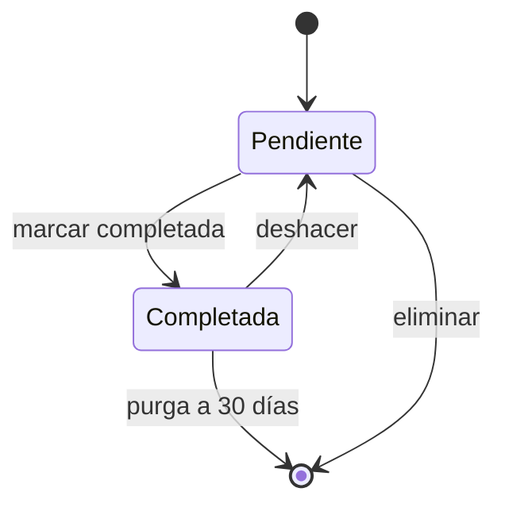

# Walkthrough — un proyecto real de principio a fin

Este tutorial sigue paso a paso el ejemplo completo que vive bajo [`examples/golden-path/`](../../examples/golden-path/README.md). Verás **qué teclea el usuario**, **qué responde cada agente**, y **qué archivo se produce en cada paso**. Tiempo estimado de lectura: 20 min.

Si algún término no te suena, consulta el [glosario](GLOSARIO_SISTEMA.md).

---

## El proyecto que vamos a bootstrapear

**Idea:** un gestor de tareas personal con recordatorios push, autoalojable, para un único usuario.

Originalmente Mario escribió el brief inicial como una página libre. Lo puedes leer completo en [`examples/golden-path/specs/brief.md`](../../examples/golden-path/specs/brief.md). Extracto:

```markdown
# Brief — Gestor de tareas personal con recordatorios

## Idea general

Una aplicación que me permita capturar tareas rápidamente desde el móvil
o el ordenador, agruparlas por proyecto, y recibir recordatorios por
notificación push cuando se acerque la fecha límite. Quiero que sea ágil:
capturar una tarea debe costar menos de 5 segundos.

## Contexto del usuario/negocio

Lo uso yo personalmente. Tengo Todoist y Things probados y no termino de
adoptarlos porque la captura es lenta o requieren pagar para lo básico.
[...]
```

Con esto como entrada, procedemos.

---

## Paso 0 — Preparación del repo

Antes de abrir Claude Code:

```bash
# Clonar el boilerplate en una carpeta nueva
git clone <ruta> gestor-tareas && cd gestor-tareas

# Como va a ser un stack típico de TS + Node, aplicamos el template pack
bash scripts/init-project.sh --template=web-typescript
# → pide nombre del proyecto, descripción
# → resuelve placeholders globales + específicos del stack
# → copia .github/instructions/*.md pre-rellenadas

# Generamos las copias adaptadas a Claude Code y Copilot
bash scripts/sync-agents.sh

# Escribimos el brief
$EDITOR specs/brief.md   # pegar el contenido anterior
```

Tras esto el repo está listo para el bootstrap.

---

## Paso 1 — /bootstrap y fase 1: spec-analyst

Abrimos Claude Code en la raíz del repo:

```bash
claude
```

Y lanzamos:

```
/bootstrap
```

El sistema detecta que `specs/brief.md` existe y no está vacío; que las plantillas de `docs/referencia/` están sin rellenar (esperado); y arranca la fase 1.

### Qué hace `@spec-analyst`

Lee el brief completo, identifica qué ya está respondido y qué falta. Las [6 dimensiones obligatorias](GLOSARIO_SISTEMA.md#sdd) son: problema/JTBD, actores y contexto, alcance (in/out), restricciones, comportamiento esperado, criterios de éxito.

Como el brief del ejemplo es bastante rico, el agente detecta **5 de 6 dimensiones presentes**. Eso dispara el skill [`quick-bootstrap`](GLOSARIO_SISTEMA.md#quick-bootstrap):

> He detectado que tu brief ya cubre:
> ✓ Problema y JTBD: "capturar una tarea debe costar menos de 5 segundos"
> ✓ Actores: "usuario único"
> ✓ Alcance: 6 funcionalidades listadas
> ✓ Restricciones: 3 restricciones técnicas/negocio/compliance
> ⚠ Comportamiento: menciona sync y push pero no edge cases
> ✗ Criterios de éxito: no detecto métricas verificables
>
> Puedo proceder en modo rápido: te propongo la spec cerrada con lo que hay y te pregunto SOLO por las dimensiones ⚠ y ✗. ¿De acuerdo?

Mario confirma. El agente hace **2 preguntas focalizadas**:

1. "¿Qué edge cases te importan? Sugiero: título vacío, fecha en el pasado, offline sin conexión, conflicto de sync entre dispositivos, eliminar proyecto con tareas dentro."
2. "Para cada criterio de éxito, necesito métrica y umbral. Te propongo 5 (S01–S05) basados en tu brief. ¿Aceptas?"

Tras resolver ambas, pregunta:

> ¿Confirmas la spec cerrada y paso a modelar dominio?

### Qué se produce

[`specs/spec-cerrada-gestor-tareas.md`](../../examples/golden-path/specs/spec-cerrada-gestor-tareas.md) — archivo de ~110 líneas con las 6 dimensiones cerradas, sin placeholders, con sección "Defaults aceptados" y "Defaults rechazados" para trazabilidad.

Fragmento de los criterios de éxito resultantes:

```markdown
| ID  | Criterio            | Métrica                         | Umbral  |
|-----|---------------------|---------------------------------|---------|
| S01 | Captura rápida      | Tiempo abrir app → crear tarea  | < 5 s   |
| S02 | Parser NL           | % frases parseadas OK           | ≥ 85 %  |
| S03 | Sync offline→online | Reconciliación ≤20 tareas       | < 3 s   |
| S04 | Notif puntual       | Desfase previsto vs recibido    | ± 5 min |
| S05 | Recursos server     | RAM uso típico                  | < 200MB |
```

Esto es **verificable**: cada criterio se convertirá en un test real más adelante.

---

## Paso 2 — Fase 2: domain-modeler

Mario confirma y invoca `@domain-modeler` (el sistema se lo sugiere explícitamente).

### Qué hace `@domain-modeler`

Lee la spec cerrada y extrae:

**Entidades candidatas** — las detecta leyendo sustantivos recurrentes: Tarea, Proyecto, Recordatorio.

**Ciclo de vida de la entidad principal** — propone un stateDiagram para Tarea:



Pregunta: "¿Falta algún estado intermedio? ¿La transición 'deshacer' tiene ventana de tiempo?" Mario confirma que deshacer solo vale dentro de 24h tras completar.

**Matriz de capacidades** — 9 filas (C01–C09) con Estado / Capacidad / Actor / Precondición.

**Glosario** — 10 términos (Captura, Fecha límite, PWA, Sync, Tarea, Vencida, etc.) con definición canónica y dónde se usan.

### Qué se produce

- [`docs/referencia/DOMINIO.md`](../../examples/golden-path/docs/referencia/DOMINIO.md) — stateDiagram + matriz + invariantes + relaciones.
- [`docs/referencia/GLOSARIO.md`](../../examples/golden-path/docs/referencia/GLOSARIO.md) — 10 términos.

Checkpoint: "¿Confirmas dominio y paso a arquitectura?". Mario confirma.

---

## Paso 3 — Fase 3: architect

Invoca `@architect`.

### Qué hace `@architect`

Lee spec + dominio. Propone stack por capa con **trade-offs explícitos** para cada elección:

> Persistencia: (A) PostgreSQL — relacional maduro, fuerte en transacciones. (B) MongoDB — documentos flexibles. (C) SQLite — file-based.
> Default recomendado: **C (SQLite)** porque tu restricción es ≤1 GB RAM en VPS pequeño y eres usuario único. No necesitas concurrencia multi-conexión. ¿Aceptas?

Mario dice sí. El agente repite el ejercicio para cada capa:

- Lenguaje: TypeScript 5.4 (una sola tecnología front+back).
- Runtime: Node 20 LTS.
- Framework backend: Fastify (más ligero que Express).
- Frontend: React + Vite con `vite-plugin-pwa`.
- Estado cliente: Zustand.
- Persistencia: SQLite + `better-sqlite3` (sincrónico).
- Push: `web-push` con VAPID.
- Testing: Vitest (unit/int) + Playwright (E2E).

**Patrón arquitectónico:** monolito modular con capas DDD ligero. Justificado por el alcance (1 usuario, 1 servidor).

**Estructura de módulos:** diagrama Mermaid + tabla de dependencias permitidas. Declara explícitamente las prohibidas: Domain no importa Infra, Application no importa Api, etc.

**Catálogo seed:** lista 13 endpoints, 6 componentes UI, 8 módulos internos, 4 utilidades — todo marcado `[[SEED]]` porque son sugerencias que se confirmarán al implementar.

**Seedea `DECISIONES.md`:** rellena las 8 categorías con las decisiones tomadas. Ejemplo de la categoría 4:

```markdown
## 4. Convenciones de código

- Identificadores en inglés (código); documentación y comentarios en español.
- Naming: camelCase funciones/variables, PascalCase tipos/clases, kebab-case archivos.
- Gestión de errores: `Result<T, DomainError>` en Domain/Application;
  excepciones solo en el borde Api→HTTP.
- Logging: pino; JSON en prod, pretty en dev.
- Comentarios: solo cuando el porqué no es obvio.
- Inyección de dependencias manual vía factories.
```

### Qué se produce

- [`docs/referencia/ARQUITECTURA.md`](../../examples/golden-path/docs/referencia/ARQUITECTURA.md) — 7 secciones (stack, patrón, módulos, prohibidas, convenciones, pirámide testing, despliegue).
- [`docs/referencia/CATALOGO.md`](../../examples/golden-path/docs/referencia/CATALOGO.md) — 31 entradas seed.
- [`docs/sesion/DECISIONES.md`](../../examples/golden-path/docs/sesion/DECISIONES.md) — 8 categorías rellenas.

Checkpoint: "¿Confirmas arquitectura y cierro bootstrap?". Mario confirma.

---

## Paso 4 — Fase 4: context-manager

Invoca `@context-manager`. Este cierra el bootstrap escribiendo el primer [`CONTEXTO.md`](../../examples/golden-path/docs/sesion/CONTEXTO.md) (sesión S1, 40 líneas):

```markdown
# CONTEXTO (sesión S1)
Última actualización: 2026-04-14

## Estado actual
| Métrica | Valor |
|---|---|
| Módulos implementados | 0 (proyecto recién inicializado) |
| Tests unitarios | 0 / 0 |
| Cobertura | 0% |
| Entorno funcional | local (sin deploy todavía) |

## Bloqueados
| ID | Motivo | Acción pendiente |
|---|---|---|
| — | — | — |

## Deuda técnica
- Primera feature por seleccionar en ROADMAP.
- Sin pipeline CI configurado aún.
- Sin volumen persistente provisionado para SQLite.

## Próxima tarea
Implementar `captura-rapida` (S01) como primera feature: endpoint
POST /api/tasks + componente TaskQuickAdd + test unit del parser.
Handoff: /analizar-funcionalidad + @feature-analyst.

## Mocks disponibles
- Ninguno aún.

## Convenciones activas
- Result<T, DomainError> (DECISIONES §4).
- Excepciones solo en borde Api→HTTP (DECISIONES §4).
- better-sqlite3 sincrónico (DECISIONES §6).
- Naming camelCase/PascalCase/kebab-case (DECISIONES §4).
- Cobertura mínima 80% con v8 (DECISIONES §5).
- Parser NL en Domain, no en Api (DECISIONES §3).
```

Nota cómo §Convenciones activas **NO copia** las decisiones — remite a `DECISIONES` por categoría. Ese es el patrón [una definición, múltiples punteros](ONBOARDING.md#regla-de-oro-de-la-memoria).

---

## Paso 5 — El sistema está operativo

A partir de aquí el bootstrap ha terminado. Mario recibe un mensaje como:

> Bootstrap completado. Archivos rellenos:
> - specs/spec-cerrada-gestor-tareas.md
> - docs/referencia/DOMINIO.md, GLOSARIO.md, ARQUITECTURA.md, CATALOGO.md, COBERTURA.md
> - docs/sesion/DECISIONES.md, CONTEXTO.md (S1)
>
> Próxima tarea sugerida (ya en CONTEXTO): implementar `captura-rapida` (S01).
> Ejecuta `/nueva-sesion` cuando arranques el siguiente día o `/analizar-funcionalidad` para planificar la primera feature.

Total de tiempo invertido en el bootstrap: ~35 minutos de conversación.

---

## Paso 6 — El ciclo normal: primera feature

Al día siguiente, Mario abre Claude Code y teclea:

```
/nueva-sesion
```

El sistema lee `CONTEXTO.md` y resume:

> **Sesión S1 — 2026-04-14**
>
> **Estado:** proyecto recién inicializado; 0 módulos, 0 tests.
>
> **Bloqueantes activos:** ninguno.
>
> **Próxima tarea:** implementar `captura-rapida` (S01). Endpoint POST /api/tasks + componente TaskQuickAdd + test del parser NL.
>
> **Convenciones activas relevantes:**
> - Result<T,E> en Domain/Application.
> - Naming camelCase/PascalCase/kebab-case.
> - Parser NL vive en Domain.
>
> **Handoff recomendado:** `/analizar-funcionalidad` + `@feature-analyst`.

Mario sigue el handoff:

```
/analizar-funcionalidad "captura-rapida (S01): crear tarea con fecha NL"
```

### `@feature-analyst` responde

- Lee CONTEXTO y DECISIONES.
- Produce un plan: matriz de impacto (Domain, Api, Web afectados), 5 criterios de aceptación verificables, pruebas recomendadas por capa (unit del parser, integración del repo, E2E del flujo), reutilización detectada (ninguna; primera feature), riesgos (timezone en fechas).
- Handoff: `@feature-developer`.

Mario aprueba el plan y ejecuta:

```
/implementar-feature
```

### `@feature-developer` aplica Gate DoD

> Antes de escribir código respondo a las 3 preguntas del [Gate DoD](GLOSARIO_SISTEMA.md#gate-dod):
>
> 1. ¿Criterio verificable? ✓ S01 es "tiempo abrir app → crear tarea < 5s" y el plan define cómo medirlo.
> 2. ¿Prueba automatizable? ✓ Test unit del parser + E2E con Playwright.
> 3. ¿Respeta ARQUITECTURA? ✓ Parser NL en Domain (dominio puro, sin I/O), endpoint en Api, componente en Web.
>
> Procedo.

Escribe el código en las rutas permitidas por la [matriz de permisos](MATRIZ_PERMISOS.md) (`src/**/*.ts`, `tests/**/*.test.ts`). Corre `pnpm test` localmente. Reporta:

> Implementación completada:
> - Archivos tocados: 7 (src/domain/task/parser.ts, src/application/task/CrearTarea.ts, src/api/tasks/post.ts, src/web/components/TaskQuickAdd.tsx, + 3 tests).
> - Tests: 18 unit pasan, 1 integración pasa, 1 E2E pasa.
> - Criterios cubiertos: S01 ✓.
> - Deuda técnica: ninguna.
> - Handoff: `@code-reviewer`.

```
/revisar-codigo
```

### `@code-reviewer` con Gate replicado

- Mapea criterio → test: S01 ↔ `tests/e2e/quick-add.spec.ts:12`.
- Verifica que la prueba E2E realmente mide tiempo, no solo que el endpoint responda.
- Escanea anti-patrones: 0 `sleep` fijos, 0 `force:true`, 0 deps nuevas sin declarar.
- Actualiza `docs/referencia/COBERTURA.md` marcando S01 como ✓.
- Veredicto: **Aprobado**.

Mario cierra la sesión:

```
/actualizar-contexto
```

### `@context-manager` cierra

- Crea `CONTEXTO.bak.md` y `DECISIONES.bak.md`.
- Reescribe `CONTEXTO.md` con S2:
  - Estado: 1 módulo implementado (captura-rapida), 18+1+1 tests pasando.
  - Próxima tarea: S02 (parser NL con fixture de 50 frases).
  - Convenciones activas: igual, ya válidas para todo el proyecto.

Fin del ciclo. El proyecto tiene S01 implementado, cubierto, documentado, y la memoria está sincronizada.

---

## Lo que NO hace el sistema

Para calibrar expectativas:

- **No escribe código sin plan.** `/implementar-feature` sin `/analizar-funcionalidad` previo se negará.
- **No pasa el Gate DoD por ti.** Si no hay criterio verificable, se detiene.
- **No cambia decisiones sin conversar.** Si una feature nueva implica nueva decisión de stack, el analyst te devuelve a `@architect`.
- **No oculta fricción.** Si hay un 🔴 en CI, el triager no lo maquilla.
- **No ejecuta handoffs automáticamente.** Cada transición requiere que escribas `@siguiente-agente`.

---

## ¿Y si algo sale mal?

Ver la sección "Fricciones típicas" en [ONBOARDING.md §7](ONBOARDING.md#7-fricciones-típicas-al-empezar). Las más frecuentes:

- Bootstrap interrumpido → `/bootstrap --resume`.
- CONTEXTO corrupto → restaurar desde `CONTEXTO.bak.md`.
- Agente no reconocido → re-ejecutar `bash scripts/sync-agents.sh`.

---

## Siguiente lectura

- Setup específico por herramienta: [`CLAUDE_CODE.md`](CLAUDE_CODE.md) o [`COPILOT.md`](COPILOT.md).
- Configurar MCP para memoria queryable y permisos ejecutables: `scripts/mcp/memory-server/README.md` + `scripts/mcp/fs-guard-server/README.md`.
- Validar tu propia adaptación: ejecuta `python scripts/mcp/memory-server/server.py --test` y `python scripts/mcp/fs-guard-server/server.py --test` en tu proyecto y verifica que todo pasa.
