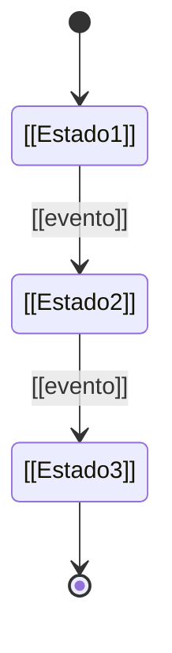

# DOMINIO

<!--
Plantilla rellenada por @domain-modeler durante /bootstrap fase 2.
Versión: v1 (incrementar si se reabre el modelado tras cerrar).
-->

## §1 Ciclo de vida de la entidad principal

Entidad: **[[NOMBRE_ENTIDAD_PRINCIPAL]]**



| Transición | Evento/Acción | Precondición |
|---|---|---|
| [[EstadoA → EstadoB]] | [[acción]] | [[regla]] |

## §2 Matriz de capacidades

| ID | Estado | Capacidad | Actor | Precondición |
|---|---|---|---|---|
| C01 | [[estado]] | [[qué puede hacer]] | [[rol]] | [[regla/invariante]] |

## §3 Invariantes

Reglas que se cumplen siempre:

- [[invariante 1]]
- [[invariante 2]]

## §4 Relaciones entre entidades

```mermaid
classDiagram
    [[EntidadA]] --> [[EntidadB]] : [[cardinalidad]]
    [[EntidadA]] --> [[EntidadC]] : [[cardinalidad]]
```

| Relación | Cardinalidad | Regla |
|---|---|---|
| [[A—B]] | [[1..N / 1..1]] | [[integridad referencial/cascadas]] |
