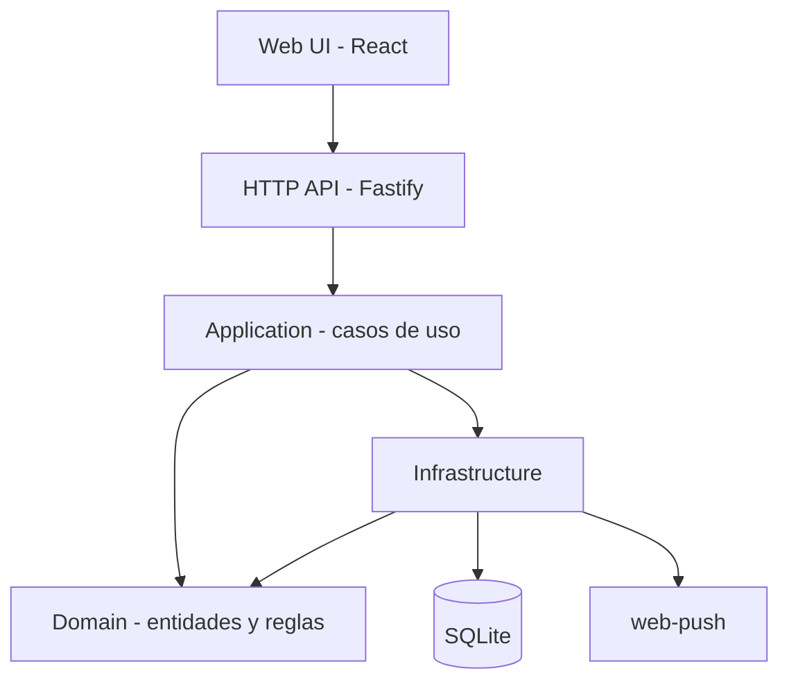

# ARQUITECTURA

## §1 Stack

| Capa | Tecnología | Versión | Motivo |
|---|---|---|---|
| Lenguaje backend | TypeScript | 5.4+ | Un solo lenguaje frontend+backend; tooling maduro |
| Runtime backend | Node.js | 20 LTS | Soporte Web Push nativo, bajo consumo de RAM |
| Framework backend | Fastify | 4.x | Más ligero que Express, validación integrada con JSON Schema |
| Frontend | React + Vite | 18 / 5 | Ecosistema maduro, PWA soportada out-of-the-box con vite-plugin-pwa |
| Estado cliente | Zustand | 4.x | Simple, suficiente para el scope; persistencia local a IndexedDB vía middleware |
| Persistencia | SQLite | 3.45+ | Cumple restricción ≤1 GB RAM; suficiente para 1 usuario; backup trivial (copia de archivo) |
| ORM | better-sqlite3 | 11.x | Sincrónico, simple, sin migraciones mágicas |
| Migraciones | umzug | 3.x | Controla esquema en código versionado |
| Web Push | web-push | 3.x | Cumple estándar VAPID, compatible con todos los navegadores modernos |
| Testing unit | Vitest | 1.x | Mismo runtime que Vite, rápido |
| Testing E2E | Playwright | 1.44+ | PWA completa, incluye mobile viewports |

## §2 Patrón global

Patrón elegido: **monolito modular con separación por capas (DDD ligero)**.

Motivación: alcance personal, un solo desarrollador, un solo usuario. Microservicios o hexagonal estricto añadirían fricción sin beneficio. Separación por capas da disciplina suficiente para testear y mantener.

## §3 Módulos y dependencias

| Módulo | Responsabilidad | Depende de |
|---|---|---|
| Domain | Entidades Tarea, Proyecto, Recordatorio. Invariantes. Parsing lenguaje natural de fechas. | — |
| Application | Casos de uso: `crearTarea`, `completarTarea`, `generarRecordatorios`, `sincronizar`. | Domain |
| Infrastructure | Repositorios SQLite, cliente web-push, scheduler de cron para recordatorios. | Domain |
| Api | Controllers Fastify, validación JSON Schema, auth sesión simple. | Application |
| Web | UI React, cliente IndexedDB offline, Service Worker para PWA y push. | Api (por HTTP) |

## §4 Dependencias prohibidas

- Domain no importa Infrastructure, Api ni Web.
- Application no importa Api ni Web.
- Infrastructure no importa Api ni Web.
- Web no conoce SQLite ni la lógica de aplicación directamente; solo habla con Api por HTTP.

## §5 Convenciones transversales

- **Naming:** camelCase para funciones y variables; PascalCase para tipos y clases; kebab-case para archivos.
- **Gestión de errores:** `Result<T, DomainError>` en Domain y Application; excepciones solo en el borde Api→HTTP (mapeadas a status codes en un único middleware).
- **Logging:** pino con niveles `info`/`warn`/`error`; formato JSON en producción, pretty en dev.
- **Validación:** en el borde Api (JSON Schema de Fastify); Domain asume entradas ya validadas.
- **Inyección de dependencias:** manual vía factories; sin framework DI.
- **Comentarios:** solo cuando el porqué no es obvio (reglas del dominio, workaround específico). Nunca narrar el qué.

## §6 Pirámide de testing

| Nivel | Porcentaje objetivo | Herramienta | Alcance |
|---|---|---|---|
| Unit | 70% | Vitest | Domain puro (parsing de fechas, invariantes), Application con repos en memoria |
| Integración | 20% | Vitest + SQLite tmpfile | Repos reales contra BBDD temporal, casos de uso end-to-end backend |
| E2E | 10% | Playwright | Flujos críticos: capturar tarea, marcar completada, sync offline→online, recibir notificación |

Cobertura mínima: **80%** medida con v8 (vitest --coverage).

## §7 Despliegue

- **Build:** `pnpm build` produce artefactos estáticos del frontend + bundle de backend.
- **Runtime:** un proceso Node sirve la API y, al mismo tiempo, sirve los estáticos del frontend como fallback.
- **BBDD:** archivo `data.sqlite` en volumen persistente.
- **Backup:** cron diario que copia `data.sqlite` con sufijo de fecha a `backups/`; retiene 14 días.
- **Scheduler:** cron interno (node-cron) evalúa recordatorios cada minuto.
