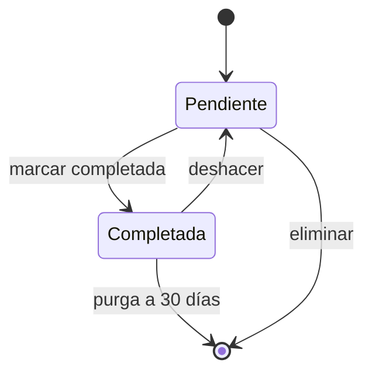
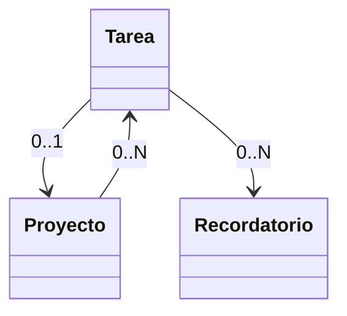

# DOMINIO

Versión: v1 (cerrada 2026-04-14)

## §1 Ciclo de vida de la entidad principal

Entidad: **Tarea**

| Transición | Evento/Acción | Precondición |
|---|---|---|
| [*] → Pendiente | crear tarea | título no vacío |
| Pendiente → Completada | marcar completada | — |
| Completada → Pendiente | deshacer (dentro del mismo día) | tarea completada hace < 24h |
| Completada → [*] | purga automática | completada hace ≥ 30 días |
| Pendiente → [*] | eliminar | usuario confirma |

## §2 Matriz de capacidades

| ID | Estado | Capacidad | Actor | Precondición |
|---|---|---|---|---|
| C01 | cualquiera | crear tarea | propietario | título no vacío |
| C02 | Pendiente | editar título/fecha/proyecto | propietario | — |
| C03 | Pendiente | marcar completada | propietario | — |
| C04 | Pendiente | eliminar | propietario | confirmación explícita |
| C05 | Completada | deshacer (volver a Pendiente) | propietario | completada < 24h |
| C06 | Pendiente | recibir recordatorio push | sistema | tarea con fecha y navegador suscrito |
| C07 | cualquiera | asociar/desasociar proyecto | propietario | proyecto existente y no archivado |
| C08 | — | crear proyecto | propietario | nombre no vacío |
| C09 | — | archivar proyecto | propietario | confirmación si tiene tareas Pendientes |

## §3 Invariantes

- Una Tarea pertenece a 0 o 1 Proyecto (nunca a más).
- `completada_en` existe ⇔ estado = Completada.
- `fecha_limite` puede ser null; si existe, puede ser pasada (entra en "vencidas").
- Un Proyecto archivado no admite tareas nuevas, pero sus tareas existentes siguen operables.
- El usuario es único y dueño de todas las entidades; no hay permisos cruzados.

## §4 Relaciones entre entidades

| Relación | Cardinalidad | Regla |
|---|---|---|
| Tarea — Proyecto | N:0..1 | si se archiva Proyecto, preguntar destino de tareas |
| Tarea — Recordatorio | 1:0..N | se genera automáticamente al fijar fecha_limite |
| Proyecto — Tarea | 1:0..N | FK nullable en Tarea |
